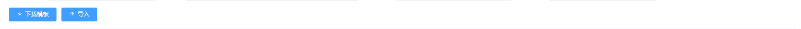

# background-template 后台模板页面

> - 组件是基于 Element-UI 的二次封装
> - 包含 pageWrap filters btnWrap pagination dialogs 五个组件
> - 其中 pageWrap 用于样式布局，其他组件以插槽的形式使用（也可单独使用）

## 安装

使用 npm:

```node
npm install background-template
```

使用 yarn:

```node
yarn add background-template
```

## 引入

在 main.js 中加入以下内容：

```js
import backgroundTemplate from "background-template";
import "background-template/lib/background-template.css";

Vue.use(backgroundTemplate);
```

在 App.vue 中加入以下内容（请勿在 style 中添加 scoped）：

```html
<style>
  html,
  body,
  #app {
    height: 100% !important;
  }
</style>
```

## 使用

### pageWrap 用于样式布局


#### pageWrap Slot

| name    | 说明                           |
| ------- | ------------------------------ |
| filters | 过滤器                         |
| btn     | 按钮栏                         |
| default | 默认的 slot(用于插入 el-table) |
| page    | 翻页器                         |

举个例子

```html
<pageWrap>
  <template v-slot:filters>
    <filters :searchList="[]"></filters>
  </template>

  <template v-slot:btn>
    <btnWrap></btnWrap>
  </template>

  <template>
    <el-table
      :data="[]"
      stripe
      height="100%"
      style="width: 100%"
      border
    >
      <el-table-column prop="a" label="header" align="center">
      </el-table-column>
  </template>

  <template v-slot:page>
    <pagination></pagination>
  </template>

  <dialogs></dialogs>
</pageWrap>
```

### filters 筛选器组件


#### filters Attributes

```js
props: {
    /**
     * 搜索列表
     *
     * type = input
     * label、key、placeholder
     * defaultValue (默认：undefined) 默认展示的数据
     *
     * type = select
     * label、key、placeholder、options
     * options = [{ label: '', value: '' }]
     * clear 触发change需要清除的数据 string[]
     *
     * type = date
     * label
     * startPlaceholder、endPlaceholder (默认：开始时间 - 结束时间)
     * clearable (默认：true)
     * valueType (默认：undefined) 为array时，value为数组
     *
     */
    searchList: {
      type: Array,
      default: () => [],
      required: true,
    },
    /**
     * 导出列表
     */
    download: {
      type: Boolean,
      default: false,
    },
    /**
     * 导出的loading
     */
    loading: {
      type: Boolean,
      default: false,
    },
  }
```

#### filters Events

| 方法名   | 说明               | 参数           |
| -------- | ------------------ | -------------- |
| search   | 点击搜索或回车触发 | searchList.key |
| download | 点击导出触发       | searchList.key |

#### filters Methods

| 事件名 | 说明           | 参数              |
| ------ | -------------- | ----------------- |
| emit   | 触发搜索或导出 | search / download |

### btnWrap 按纽栏组件



#### btnWrap Attributes

```js
props: {
    /**
     * 按钮列表 id 唯一标识
     * downloadTemplate 下载模板(点击之后会 loading，请使用 changeLoading 停止)
     * upload 导入
     * add 新增
     * edit 编辑
     */
    eventsList: {
      type: Array, // []string
      default: () => [],
    },
  }
```

#### btnWrap Events

| 方法名           | 说明     |
| ---------------- | -------- |
| downloadTemplate | 下载模板 |
| upload           | 导入     |
| add              | 新增     |
| edit             | 编辑     |

#### btnWrap Methods

| 事件名        | 说明               | 参数        | 默认值          |
| ------------- | ------------------ | ----------- | --------------- |
| changeLoading | 修改按钮的 loading | id, loading | loading = false |

### pagination 翻页器


> - pageSizes: [15, 30, 60]

#### pagination Events

| 方法名 | 说明               | 参数                            |
| ------ | ------------------ | ------------------------------- |
| change | 翻页/修改 pageSize | { pageSize: 1, currentPage: 1 } |

#### pagination Methods

| 方法名    | 说明                   |
| --------- | ---------------------- |
| resetPage | 重置页码(pageSize = 1) |

> - 这里对 el-pagination 也进行了兼容 [Element-UI pagination 的默认事件](https://element.eleme.cn/#/zh-CN/component/pagination)

### dialogs 弹窗


#### dialogs Attributes

```js
props: {
    /**
     * width height(maxHeight)
     */
    dialogConfig: {
      type: Object,
      default: () => ({}),
    },
    title: {
      type: String,
      default: "",
    },
    fullScreen: { // 是否展示全屏按钮
      type: Boolean,
      default: false,
    },
  }
```

> - 这里对 el-dialog 也进行了兼容 [Element-UI dialog 的默认事件](https://element.eleme.cn/#/zh-CN/component/dialog)

## 目录结构

```markdown
|-- src
|-- App.vue
|-- index.js
|-- main.js
|-- assets
| |-- logo.png
| |-- styles
| |-- class.styl
| |-- index.styl
|-- components
| |-- btnWrap.vue // 按钮组件
| |-- dialogs.vue // 弹窗组件
| |-- filters.vue // 筛选器组件
| |-- init.js
| |-- pageWrap.vue // page 组件(所有的组件都以 slot 的方式实现)
| |-- pagination.vue // 翻页组件
|-- router
| |-- index.js
|-- store
| |-- index.js
|-- utils
| |-- initCss.js
| |-- initElement.js
|-- views
|-- About.vue
|-- Home.vue
```
